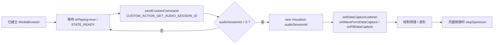

# 音频频谱接入

> 适用对象：Unity / 原生 Android / 任何想做频谱可视化的接入方
> 技术方案：`CUSTOM_ACTION_GET_AUDIO_SESSION_ID` + Android `Visualizer`

本页只覆盖 **音频频谱（waveform / FFT）数据采集**：通过自定义命令拿到当前播放器的 `audioSessionId`，再用 Android 系统 `Visualizer` 绑定到该 session 实时采样。

> 基础的 `MediaBrowser` 连接、播放控制、歌词获取等不在本页 —— 请先按 [集成指南](integration-guide/index.md) 建好连接、按 [歌词对接](lyric-guide.md) 拉到 metadata。本页假设你已经持有一个连接好的 `MediaBrowser`。

## 1. 流程概览



## 2. 仅网易云音乐源支持

`CUSTOM_ACTION_GET_AUDIO_SESSION_ID` 当前**只在网易云音乐媒体源上实现**。其它媒体源（爱奇艺、Spotify、RadioBrowser、短剧）调用会返回失败或无效 session。

媒体源 `ComponentName`：

```kotlin
val NETEASE_SOURCE = ComponentName(
    "com.jidouauto.netease.jdo",
    "com.jidouauto.netease.jdo.service.JdoMusicMediaService"
)
```

## 3. 权限声明

接入方需要在 `AndroidManifest.xml` 中声明录音权限，并在运行时申请：

```xml
<uses-permission android:name="android.permission.RECORD_AUDIO" />
```

!!! warning "Android 6+ 必须运行时授权"
    `RECORD_AUDIO` 是 dangerous 权限。
    - 原生 Android：`ActivityCompat.requestPermissions(...)`
    - Unity：`Permission.RequestUserPermission(Permission.Microphone)`

## 4. 获取 audioSessionId

建议在播放器进入 `Player.STATE_READY` 或 `onIsPlayingChanged(true)` 之后再请求；返回值 `<= 0` 说明播放器还没拿到有效 session，需要延迟重试。

```kotlin
private const val CUSTOM_ACTION_GET_AUDIO_SESSION_ID = "CUSTOM_ACTION_GET_AUDIO_SESSION_ID"
private const val EXTRA_AUDIO_SESSION_ID = "EXTRA_AUDIO_SESSION_ID"

fun fetchAudioSessionId(browser: MediaBrowser, onResult: (Int) -> Unit) {
    val future = browser.sendCustomCommand(
        SessionCommand(CUSTOM_ACTION_GET_AUDIO_SESSION_ID, Bundle()),
        Bundle(),
    )

    Futures.addCallback(
        future,
        object : FutureCallback<SessionResult> {
            override fun onSuccess(result: SessionResult?) {
                val audioSessionId = result?.extras?.getInt(EXTRA_AUDIO_SESSION_ID, 0) ?: 0
                onResult(audioSessionId)
            }

            override fun onFailure(t: Throwable) {
                onResult(0)
            }
        },
        ContextCompat.getMainExecutor(appContext),
    )
}
```

## 5. 使用 Visualizer 采集频谱

`audioSessionId` 有效后，绑定 `Visualizer` 到该 session：

```kotlin
private var visualizer: Visualizer? = null
private var currentAudioSessionId = 0

fun startSpectrum(audioSessionId: Int) {
    if (audioSessionId <= 0) return
    if (currentAudioSessionId == audioSessionId && visualizer != null) return

    stopSpectrum()
    currentAudioSessionId = audioSessionId

    visualizer = Visualizer(audioSessionId).apply {
        captureSize = Visualizer.getCaptureSizeRange()[1]
        setDataCaptureListener(
            object : Visualizer.OnDataCaptureListener {
                override fun onWaveFormDataCapture(
                    visualizer: Visualizer,
                    waveform: ByteArray,
                    samplingRate: Int,
                ) {
                    // waveform 可用于绘制时域波形
                }

                override fun onFftDataCapture(
                    visualizer: Visualizer,
                    fft: ByteArray,
                    samplingRate: Int,
                ) {
                    val magnitudes = fftToMagnitudes(fft)
                    // magnitudes 可用于绘制频谱柱状图
                }
            },
            Visualizer.getMaxCaptureRate(),
            true,   // captureWaveform
            true,   // captureFft
        )
        enabled = true
    }
}

fun stopSpectrum() {
    visualizer?.let { v ->
        runCatching {
            v.enabled = false
            v.release()
        }
    }
    visualizer = null
    currentAudioSessionId = 0
}
```

## 6. FFT → 幅值

`onFftDataCapture` 给的是交错的实部 / 虚部对，常见做法是合成幅值数组用于柱状图：

```kotlin
private fun fftToMagnitudes(fft: ByteArray): FloatArray {
    if (fft.size < 2) return FloatArray(0)

    val result = FloatArray(fft.size / 2)
    var i = 2
    var outIndex = 1
    result[0] = kotlin.math.abs(fft[0].toInt()).toFloat()
    while (i + 1 < fft.size && outIndex < result.size) {
        val real = fft[i].toInt()
        val imag = fft[i + 1].toInt()
        result[outIndex] = kotlin.math.sqrt((real * real + imag * imag).toFloat())
        i += 2
        outIndex++
    }
    return result
}
```

## 7. 生命周期建议

- **何时取 sessionId**：`onIsPlayingChanged(true)` 或 `Player.STATE_READY` 之后
- **sessionId 变化时机**：播放器重建 / 切源 / 异常恢复 → 频谱回调断流时**重新调用** `CUSTOM_ACTION_GET_AUDIO_SESSION_ID` 并重建 `Visualizer`
- **页面销毁 / 模块退出**：必须 `stopSpectrum()` 释放 `Visualizer`（否则 effect 资源泄漏，下次进来会失败）
- **多 Visualizer 同时存在**：系统对同一 sessionId 通常只允许一个 Visualizer，先 `release` 旧实例再建新实例

## 8. Unity 接入提示

Unity 项目通常通过 Android Plugin（AAR / Java 模块）来调用 Media3 API。需要注意：

- 把 Java/Kotlin 层的连接 + 频谱回调封装为 `MediaBridge`，导出 C# 友好的接口
- `Visualizer` 回调线程**不是 Unity 主线程**，绘制前用 `UnitySendMessage` 或 `AndroidJavaRunnable` 切回主线程
- IL2CPP + R8 混淆时保留 `Player.Listener` / `FutureCallback` / `Visualizer.OnDataCaptureListener` 等反射桥接类
- Unity 模板 `mainTemplate.gradle` / `AndroidManifest.xml` 必须显式声明 `RECORD_AUDIO` 权限和 `<queries>` 包可见性，AAR 内部声明在部分 Unity 版本下不会合入最终 APK

## 9. 排查

| 现象 | 原因 | 修复 |
| --- | --- | --- |
| `fetchAudioSessionId` 返回 0 | 播放器未 ready / 媒体源不支持 | 等到 `STATE_READY`，确认是网易云源 |
| `Visualizer(...)` 抛 `RuntimeException` | 权限 / sessionId / 系统策略限制 | 检查 RECORD_AUDIO，sessionId > 0，部分车机 OEM 屏蔽了应用层 Visualizer |
| FFT 数据全 0 | sessionId 已失效（切源 / 重建播放器） | 重新拉 sessionId 重建 Visualizer |
| 切歌后无频谱回调 | 旧 Visualizer 绑的是旧 session | 监听 `onMediaItemTransition` 重新走步骤 4–5 |
| 关页面后偶发 crash | 没 `release()` Visualizer | `stopSpectrum()` 必须在 `onDestroy` / `Dispose` 调用 |

## 相关协议常量

| 常量 | 字面量 | 用途 |
| --- | --- | --- |
| `CUSTOM_ACTION_GET_AUDIO_SESSION_ID` | `"CUSTOM_ACTION_GET_AUDIO_SESSION_ID"` | 获取当前播放器 `audioSessionId` |
| `EXTRA_AUDIO_SESSION_ID` | `"EXTRA_AUDIO_SESSION_ID"` | `SessionResult.extras` 里的 `Int` key |

完整 API 速查见 [API 清单](api-reference.md#custom-action音频频谱)。
