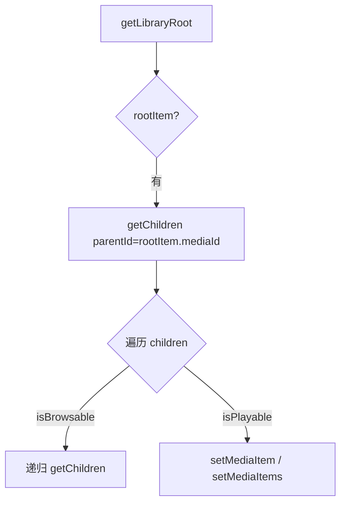

# 浏览媒体内容

## 获取根节点

```kotlin
val rootResult = browser.getLibraryRoot(null).await()
val rootItem = rootResult.value
```

## 获取子节点

```kotlin
val childrenResult = browser.getChildren(
    rootItem.mediaId,
    1,
    Int.MAX_VALUE,
    null
).await()

val children = childrenResult.value.orEmpty()
```

## 判断节点类型

```kotlin
val isBrowsable = item.mediaMetadata.isBrowsable == true
val isPlayable = item.mediaMetadata.isPlayable == true
val mediaType = item.mediaMetadata.mediaType
```

常见用法：

- `isBrowsable == true`：继续请求 children
- `isPlayable == true`：可直接播放

## 推荐访问模式



!!! tip "分页建议"
    `getChildren(parentId, page, pageSize, params)` 的 `page` 从 1 开始计数；如不需要分页可传 `Int.MAX_VALUE`。
