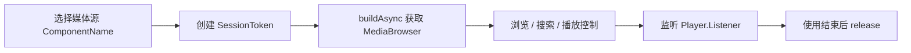

# 集成指南概览

本指南覆盖外部接入媒体中心的全部能力，按功能拆分为独立章节。

## 章节列表

1. [接入说明](overview.md) — 接入前置说明与官方文档参考
2. [支持的媒体源](media-sources.md) — `ComponentName` 列表与示例
3. [依赖配置](dependencies.md) — Gradle 依赖与 `AndroidManifest` 配置
4. [建立连接](connect.md) — `SessionToken + MediaBrowser` 创建与释放
5. [浏览媒体内容](browse.md) — 根节点、子节点、节点类型
6. [搜索](search.md) — 关键字搜索与搜索热词
7. [播放控制](playback.md) — 单条 / 列表 / mediaId 播放、语音助手实战
8. [播放模式](playback-mode.md) — 顺序 / 单曲 / 随机
9. [收藏管理](favorite.md) — `setRating + HeartRating`
10. [播放状态与 metadata](playback-state.md) — 直接读取与监听
11. [当前媒体源信息](current-source.md) — `ComponentName` / `packageName` 应用信息
12. [业务协议约定](protocol.md) — 详情列表、查询类型、搜索分组
13. [Spotify 兼容](spotify.md) — 自定义 command 兼容路径
14. [接入建议](suggestions.md) — 媒体访问层职责拆分

## 接入流程速查

## 结论速读

外部接入请统一采用 Media3 官方方式：

1. 选择目标媒体源 `ComponentName`
2. 创建 `SessionToken`
3. 通过 `MediaBrowser` 完成浏览、搜索、收藏、播放控制和状态监听
4. 使用结束后主动 `release`
