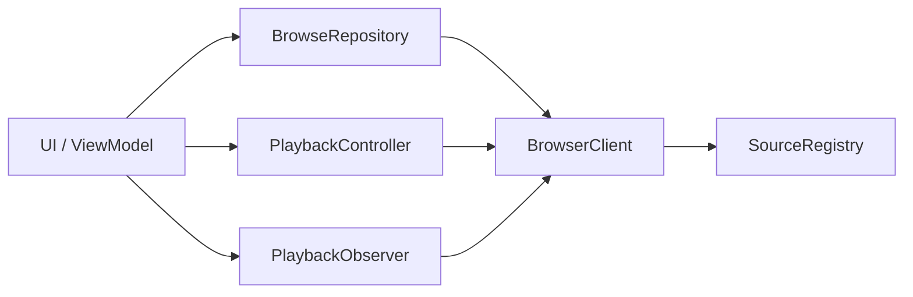

# 接入建议

推荐封装一个自己的媒体访问层，职责可简单拆分为：

| 模块 | 职责 |
| --- | --- |
| `SourceRegistry` | 维护媒体源 `ComponentName` |
| `BrowserClient` | 负责 connect / reconnect / release |
| `BrowseRepository` | 负责 root / children / search |
| `PlaybackController` | 负责播放控制 |
| `PlaybackObserver` | 负责状态、进度、metadata 监听 |

## 推荐分层结构



## 简易代码骨架

```kotlin
class SourceRegistry {
    val all: List<ComponentName> = listOf(
        MediaBrowserManager.MEDIA_SOURCE_NETEASE,
        MediaBrowserManager.MEDIA_SOURCE_IQY,
        MediaBrowserManager.MEDIA_SOURCE_RADIO_BROWSER,
        MediaBrowserManager.MEDIA_SOURCE_SPOTIFY,
        MediaBrowserManager.MEDIA_SOURCE_SHORT_PLAY,
    )
}

class BrowserClient(private val context: Context) {
    private var browser: MediaBrowser? = null

    suspend fun connect(source: ComponentName): MediaBrowser {
        val token = SessionToken(context, source)
        val newBrowser = MediaBrowser.Builder(context, token).buildAsync().await()
        browser?.release()
        browser = newBrowser
        return newBrowser
    }

    fun release() {
        browser?.release()
        browser = null
    }
}
```

## 结论

外部接入请统一采用 Media3 官方方式：

1. 选择目标媒体源 `ComponentName`
2. 创建 `SessionToken`
3. 通过 `MediaBrowser` 完成浏览、搜索、收藏、播放控制和状态监听
4. 使用结束后主动 `release`

按本文档方式即可完成当前媒体中心支持范围内的外部接入。
